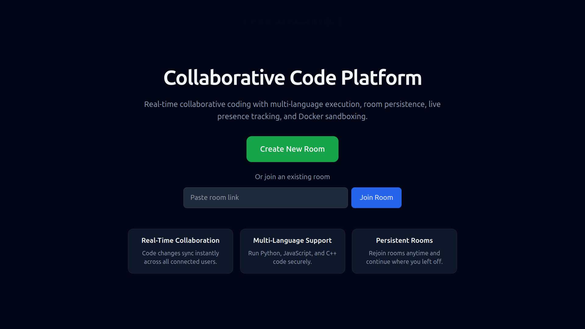
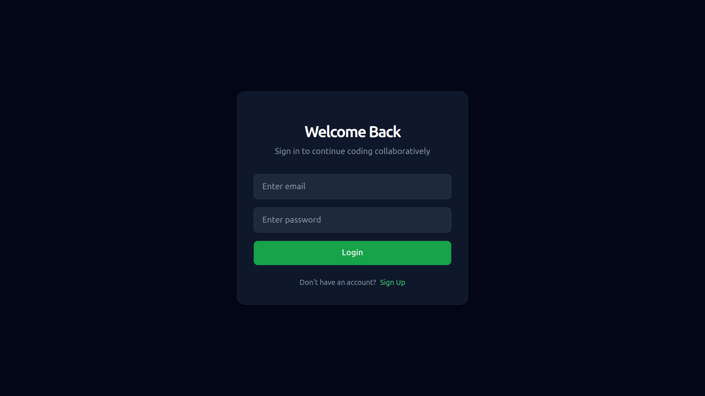
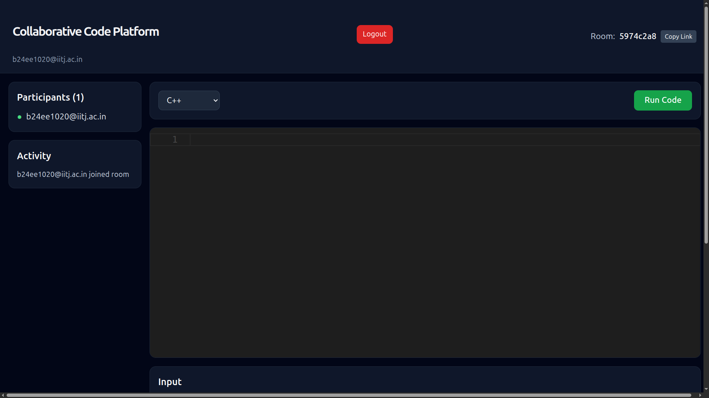

# Collaborative Code Platform

A real-time collaborative coding environment where developers can write, run, and share code together — instantly.

Create a room, invite teammates via a shareable link, and collaborate live with synced editors, presence tracking, and secure multi-language code execution.

---

## Table of Contents

- [Overview](#overview)
- [Screenshots](#screenshots)
- [Key Features](#key-features)
- [Tech Stack](#tech-stack)
- [Architecture](#architecture)
- [Project Structure](#project-structure)
- [Getting Started](#getting-started)
  - [Prerequisites](#prerequisites)
  - [Environment Variables](#environment-variables)
  - [Database Setup](#database-setup)
  - [Run the Backend](#run-the-backend)
  - [Run the Frontend](#run-the-frontend)
- [Usage Guide](#usage-guide)
- [API Reference](#api-reference)
- [WebSocket Events](#websocket-events)
- [Security](#security)
- [Roadmap](#roadmap)
- [Contributing](#contributing)
- [License](#license)

---

## Overview

**Collaborative Code Platform** is a full-stack web application built for pair programming, technical interviews, classroom coding sessions, and team prototyping. Users authenticate securely, create or join UUID-based rooms, and collaborate in real time while running Python, JavaScript, or C++ code inside Docker sandboxes.

| Layer     | Technology                                  |
| --------- | ------------------------------------------- |
| Frontend  | React 19, Vite, Tailwind CSS, Monaco Editor |
| Backend   | Go, Gin, Gorilla WebSocket                  |
| Database  | PostgreSQL                                  |
| Execution | Docker (isolated sandboxes)                 |
| Auth      | JWT + bcrypt                                |

---

## Screenshots

### Home Page

Create a new room or join an existing one with a shareable link.




---

### Login Page

Secure email/password authentication with JWT session management.




---

### Signup Page

Quick account creation to start collaborating.


---

### Dashboard / Editor

The main collaborative workspace — live editor, participants, activity feed, language selector, input, and output panels.




---

### Real-Time Collaboration

Side-by-side view showing code syncing across two browser tabs or users.

[Watch Video](docs/videos/demo.webm)

---

## Key Features

### Real-Time Collaboration

- Live code synchronization across all connected users in a room
- Debounced WebSocket updates for smooth, low-latency editing
- Language changes sync instantly for every participant

### Room-Based Sessions

- Create rooms with a single click (`crypto.randomUUID()`)
- Join via room ID or full shareable URL
- Copy room link directly from the editor toolbar
- Room code and language persisted to PostgreSQL — rejoin anytime and pick up where you left off

### Live Presence & Activity

- See who is currently in the room
- Real-time join/leave notifications
- Activity feed showing the latest room events

### Multi-Language Code Execution

- **Python** — `python:3.11`
- **JavaScript** — `node:22-alpine`
- **C++** — `gcc:15-bookworm`
- Stdin input support for interactive programs
- Execution output broadcast to all users in the room

### Secure Sandboxed Execution

Each run happens inside a hardened Docker container with:

- No network access (`--network none`)
- Read-only filesystem
- CPU, memory, and PID limits
- 5-second execution timeout

### Authentication & Authorization

- Email/password signup with validation
- bcrypt password hashing
- JWT-based protected routes
- Auto-redirect on token expiry

### Modern Developer Experience

- Monaco Editor (same engine as VS Code)
- Dark-themed, responsive UI with Tailwind CSS
- Clean REST + WebSocket API design
- Layered Go backend architecture

---

## Highlights

- Real-time collaboration using WebSockets
- Multi-language execution (Python, JavaScript, C++)
- Docker-based sandboxing with resource limits
- JWT authentication and protected routes
- PostgreSQL-backed room persistence
- Live presence tracking and activity feed

---

## Tech Stack

### Frontend

| Package        | Purpose                 |
| -------------- | ----------------------- |
| React 19       | UI framework            |
| Vite 8         | Build tool & dev server |
| React Router 7 | Client-side routing     |
| Monaco Editor  | Code editing            |
| Axios          | HTTP client             |
| Tailwind CSS   | Styling                 |

### Backend

| Package             | Purpose             |
| ------------------- | ------------------- |
| Go 1.26             | Server language     |
| Gin                 | HTTP framework      |
| Gorilla WebSocket   | Real-time messaging |
| pgx                 | PostgreSQL driver   |
| golang-jwt          | JWT auth            |
| golang.org/x/crypto | bcrypt hashing      |

---

## Architecture

```
┌─────────────────────────────────────────────────────────────┐
│                        Frontend (React)                      │
│  Home → Login/Signup → Dashboard (Monaco + WebSocket client) │
└───────────────┬─────────────────────────┬───────────────────┘
                │ REST (JWT)               │ WebSocket
                ▼                          ▼
┌─────────────────────────────────────────────────────────────┐
│                     Backend (Go + Gin)                       │
│  ┌──────────┐  ┌──────────────┐  ┌──────────────────────┐  │
│  │ Auth API │  │ Execution API│  │ WebSocket Hub/Rooms  │  │
│  └────┬─────┘  └──────┬───────┘  └──────────┬───────────┘  │
│       │               │                      │              │
│       ▼               ▼                      ▼              │
│  User Repository  Docker Executor      Room Repository       │
└───────┬───────────────────────────────┬─────────────────────┘
        │                               │
        ▼                               ▼
   PostgreSQL                      Docker Engine
   (users, rooms)              (python, node, gcc images)
```

**Real-time flow:** Editor change → WebSocket → Hub → broadcast to room → DB persist → all clients update.

**Execution flow:** Run button → REST `/execute` → Docker sandbox → output broadcast via WebSocket to entire room.

---

## Project Structure

```
collab-code-platform/
├── backend/
│   ├── cmd/main.go                 # Server entry point
│   ├── configs/                    # Environment & database config
│   ├── scripts/init.sql            # Database schema
│   └── internal/
│       ├── auth/                   # JWT utilities
│       ├── dto/                    # Request/response structs
│       ├── execution/              # Docker-based code runners
│       ├── handlers/               # HTTP handlers
│       ├── middleware/             # CORS, logging, JWT auth
│       ├── models/                 # Domain models
│       ├── repositories/           # Database access layer
│       ├── routes/                 # Route registration
│       ├── services/               # Business logic
│       └── websocket/              # Hub, rooms, clients, handler
├── frontend/
│   └── src/
│       ├── pages/                  # Home, Login, Signup, Dashboard
│       ├── components/             # CodeEditor, LanguageSelector, OutputPanel
│       ├── services/               # API, auth, execution, WebSocket
│       ├── context/                # AuthContext
│       └── routes/                 # ProtectedRoute
├── docs/
│   └── screenshots/                # README images
└── README.md
```

---

## Getting Started

### Prerequisites

Make sure the following are installed and running:

- [Go](https://go.dev/) 1.26+
- [Node.js](https://nodejs.org/) 18+
- [PostgreSQL](https://www.postgresql.org/)
- [Docker](https://www.docker.com/) with these images pulled:

```bash
docker pull python:3.11
docker pull node:22-alpine
docker pull gcc:15-bookworm
```

### Environment Variables

Create a `.env` file inside the `backend/` directory:

```env
PORT=8080

DB_HOST=localhost
DB_PORT=5432
DB_USER=postgres
DB_PASSWORD=your_password
DB_NAME=collab_code

JWT_SECRET=your_super_secret_jwt_key
```

> **Note:** The backend requires a `.env` file at startup. Generate a strong random string for `JWT_SECRET`.

### Database Setup

1. Create the database:

```bash
createdb collab_code
```

2. Run the initialization script:

```bash
psql -d collab_code -f backend/scripts/init.sql
```

This creates the `users` and `rooms` tables.

### Run the Backend

```bash
cd backend
go mod download
go run cmd/main.go
```

The API server starts on `http://localhost:8080`.

### Run the Frontend

```bash
cd frontend
npm install
npm run dev
```

The app opens at `http://localhost:5173`.

---

## Usage Guide

1. **Sign up** at `/signup`, then **log in** at `/login`.
2. From the **Home** page, click **Create New Room** or paste an existing room link to join.
3. Share the editor URL (`/editor/<room-id>`) with collaborators.
4. Write code together — changes sync in real time across all connected clients.
5. Select a language, provide stdin input if needed, and click **Run Code**.
6. View output locally and see it broadcast to everyone in the room.

---

## API Reference

### Public Endpoints

| Method | Endpoint                       | Description                  |
| ------ | ------------------------------ | ---------------------------- |
| `POST` | `/signup`                      | Register a new user          |
| `POST` | `/login`                       | Authenticate and receive JWT |
| `GET`  | `/ws/:roomId?username=<email>` | WebSocket room connection    |

### Protected Endpoints (Bearer JWT required)

| Method | Endpoint   | Description                       |
| ------ | ---------- | --------------------------------- |
| `GET`  | `/me`      | Get current authenticated user    |
| `POST` | `/execute` | Execute code and broadcast output |

#### Execute Request Body

```json
{
  "roomId": "uuid-of-room",
  "language": "python",
  "code": "print('Hello, World!')",
  "input": ""
}
```

#### Execute Response

```json
{
  "stdout": "Hello, World!\n",
  "stderr": ""
}
```

---

## WebSocket Events

### Client → Server

| Type              | Payload                                               | Description               |
| ----------------- | ----------------------------------------------------- | ------------------------- |
| `code_change`     | `{ "type": "code_change", "code": "..." }`            | Broadcast code update     |
| `language_change` | `{ "type": "language_change", "language": "python" }` | Broadcast language change |

### Server → Client

| Type               | Payload                                                    | Description              |
| ------------------ | ---------------------------------------------------------- | ------------------------ |
| `code_change`      | `{ "type": "code_change", "code": "..." }`                 | Current room code        |
| `language_change`  | `{ "type": "language_change", "language": "..." }`         | Current room language    |
| `presence`         | `{ "type": "presence", "count": 2, "users": ["a@b.com"] }` | Online participants      |
| `user_joined`      | `{ "type": "user_joined", "username": "..." }`             | User joined notification |
| `user_left`        | `{ "type": "user_left", "username": "..." }`               | User left notification   |
| `execution_output` | `{ "type": "execution_output", "output": "..." }`          | Shared run output        |

---

## Security

| Area           | Implementation                                               |
| -------------- | ------------------------------------------------------------ |
| Passwords      | bcrypt hashing                                               |
| Sessions       | JWT (HS256, 24-hour expiry)                                  |
| Code execution | Docker isolation — no network, read-only FS, resource limits |
| API access     | JWT middleware on protected routes                           |
| CORS           | Restricted to `http://localhost:5173`                        |

---

## Roadmap

- [ ] Collaborative stdin synchronization
- [ ] Room ownership and permissions
- [ ] Syntax theme customization
- [ ] Execution history
- [ ] Support for additional languages (Java, Go)
- [ ] Production deployment

---

## Motivation

This project was built to explore real-time collaborative systems, WebSockets, Docker sandboxing, and distributed state synchronization. The goal was to create a lightweight coding platform inspired by collaborative editors such as Replit and Google Docs while maintaining secure multi-language code execution.

---

## Contributing

Contributions are welcome! To get started:

1. Fork the repository
2. Create a feature branch (`git checkout -b feature/amazing-feature`)
3. Commit your changes (`git commit -m 'Add amazing feature'`)
4. Push to the branch (`git push origin feature/amazing-feature`)
5. Open a Pull Request

Please keep changes focused and follow the existing code style in both Go and React files.

---

## License

This project is currently unlicensed.

---

<p align="center">
  Built with Go, React, and WebSockets
</p>
